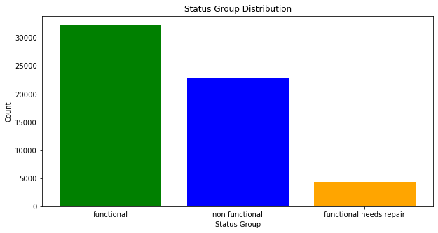

# Predicting Functional Status Of Water Wells In Tanzania

**Author**: Joan Njoroge

## Repository Structure

- README.md: The top level README for reviewers of this project
- main_notebook.ipynb: narritive documentation of analysis in jupyter notebook
- TanzaniaWaterWellsSlides.pdf: pdf version of project presentation slides
- Data folder: Contains datasets used in this project

## Business problem

This study aims to forecast the functional condition of Tanzanian water wells using machine learning classification algorithms. Functional, non-functional, and functional but in need of repair are the several status groups for classification. The idea is to increase access to water throughout Tanzania by forecasting a well's operational state.

## Data
The data used for this project is from the Data Driven website. The link to the website to obtain the data for yourself is: https://www.drivendata.org/competitions/7/pump-it-up-data-mining-the-water-table/page/23/

## Approach
The approach for this project was to create many different model types to see what performs the best and to compare and contrast the different types of models.

 First data was prepared through filling missing values and dropping features that did not seem useful to the analysis. EDA was also carried to to have an idea of how the data was distributed. Scaling using standard scaler and encoding was done with the goal of increasing accuracy of the models.

 

## Methods
To account for the class imbalance, SMOTE was used to oversample the "needs repair" and "nonfunctional" classes. 

For each type of model, a model was first trained and fitted with default parameters as a base. Then, key parameters were chosen to tune using sklearn GridSearchCV and the best parameters were used to run the model. Performance was compared to the base model of each type, as well as between different model types. Micro recall was used as the scoring metric for optimization for tuning. Models were evaluated using a classification report, a confusion matrix, ROC plots with AUC scores, and feature importances where applicable.

For the final model, various methods for understanding the important features from the model were analyzed before making recommendations.

## Results

> Confusion matrix results of the XGBoost model

## Recommendations

- Wells that are known to be dry should be considered for looking at most closely as that would make a well most likely to be non functional. Dry wells were the most important feature for the best model.

- The construction year is an important modeling feature  with older wells being more likely to be non functional or need repair. With further analysis an ideal time frame of when to service wells could be found that would balance cost and prevention of wells being out of service.

- The population around the well was another important modeling feature. Wells with a lower surrounding population should be checked for maintenance as the median population was lower for wells in the needs repair and non functional classes. 

- Having so many of the models use location data like latitude, longitude, region, and LGA as important features for prediction means that where the well is located is a big factor of whether it is working or not. This matter should be investigated to try to bridge any disparity gaps and bring more reliable water wells to the regions with the most non functioning wells.

- The features that were added of distance to the nearest city and servicing water lab came up often as important features so they should be added to the data collection process of the wells.

- To get better results, especially on the needs repair class, more features will need to be added during the data collection process. Adding information in the reporting of wells such as when the well was last serviced, what kind of repairs have been done on the wells, or if any parts have been replaced in the reporting of wells could prove to be useful for better predictions. 

## Further Directions

- <b>Try more model types</b> - For example, Catboost is a model that is supposed to work well on data with many categorical features. This dataset has more categorical features than numerical so it may be worth testing.

- <b>Further tuning</b> - It's possible that more fine tuning of models could bring more accuracy. For example, there is plenty of opportunity to try more parameters or meta classifiers with the stacking classifier.

- <b>More feature engineering</b> - More research could possibly bring up more features to add to the dataset like were found with the servicing water labs. Or if there was some manipulating of certain features in the dataset to bring out more meaningful features.

